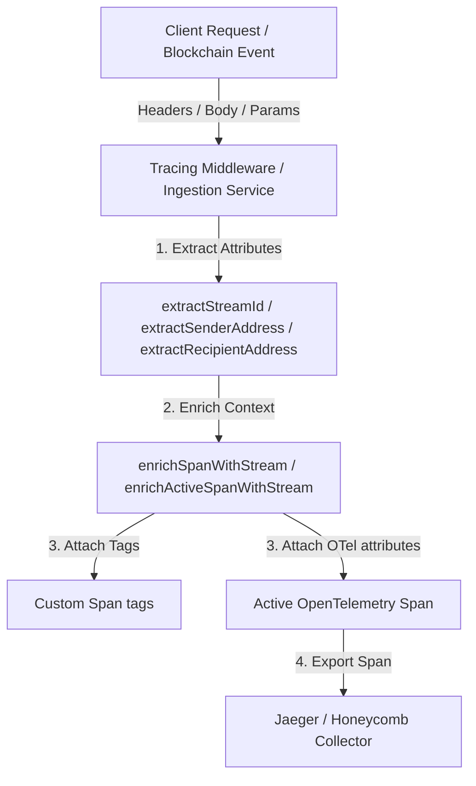

# OpenTelemetry Span Attributes Enrichment Documentation

Distributed tracing provides full visibility into programmable treasury streams on Stellar. To enable robust searching, grouping, and filtering across observability platforms, OpenTelemetry spans in Fluxora are enriched with core domain attributes.

## Attribute Reference

Every active span across the HTTP request lifecycle, blockchain event ingestion, and database access is enriched with the following attributes under the `fluxora` namespace:

| Attribute Key | Type | Description | Source Locations |
| :--- | :--- | :--- | :--- |
| `fluxora.stream_id` | `string` | The unique deterministic identifier of the stream (format: `stream-{txHash}-{eventIndex}`). | `X-Stream-Id`, `stream_id` body/query, `/api/streams/:id` path matching |
| `fluxora.sender` | `string` | The Stellar G-address of the account funding/sending the stream. | `X-Sender-Address`, `sender` body/query, database record |
| `fluxora.recipient` | `string` | The Stellar G-address of the account receiving the stream. | `X-Recipient-Address`, `recipient` body/query, database record |

---

## Observability Architecture Pipeline

The diagram below details how trace context and domain attributes propagate from public internet clients and Stellar blockchain events through the tracing layers:



---

## Verification in Observability Platforms

Once exported via the OTLP Trace Exporter, these attributes can be used to query and visualize trace flows.

### 1. Honeycomb
Honeycomb allows powerful grouping and filtering. To locate streams and analyze latency:

* **Filter by Stream:**
  In the query builder, add a filter rule:
  ```text
  fluxora.stream_id == "stream-5f3de81c...-0"
  ```
  This isolates the exact trace for that stream, including Express routing, PostgreSQL queries (`db.query`), and WebSocket broadcasts.

* **Group by Sender or Recipient:**
  To view which senders are generating the highest volume of API calls or experiencing high-latency DB operations:
  ```text
  Group By: fluxora.sender
  Visualize: HEATMAP(duration_ms)
  ```

---

### 2. Jaeger
Jaeger provides standard search capabilities for trace attributes:

* **Search by Tags:**
  In the Jaeger UI, select the service (e.g., `fluxora-backend`) and enter the search criteria in the **Tags** field:
  ```text
  fluxora.stream_id=stream-5f3de81c...-0
  ```
  Or to locate all stream actions initiated by a specific sender:
  ```text
  fluxora.sender=GAAA123...
  ```

---

## Manual Verification / Local Logging

To verify that attributes are being correctly attached locally, you can enable verbose span event logging by setting:
```bash
TRACING_OTEL_ENABLED=true
LOG_LEVEL=debug
```
When a stream request is processed, the standard console logger will output:
```json
{
  "level": "info",
  "message": "Stream created",
  "id": "stream-5f3de81c...-0",
  "requestId": "req-12345",
  "correlationId": "corr-54321",
  "action": "created"
}
```
And check that the corresponding active span in the background OTel trace contains the `fluxora.stream_id`, `fluxora.sender`, and `fluxora.recipient` attributes.
